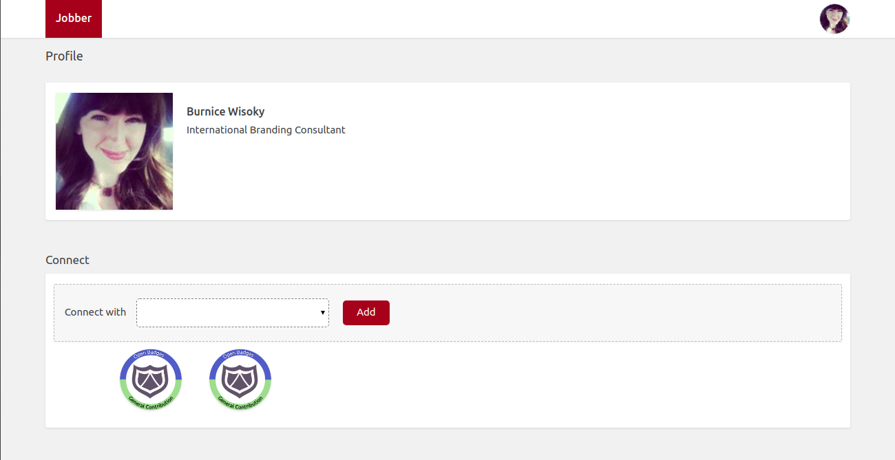

## Getting started locally on your machine

- You need to install nodejs 12+ for the services to work correctly. 
- Rename all .env.example to .env to use the enviroment variables needed.
- Change whatever configuration in the .env file to fit your running machine.
- In each of client , host and oauth application, run 'npm install'
- Run these commands respectively in client and oauth folder path: 
	- npm run build
	- npm run copy-static-assets
	- npm run start
- Run these commands respectively in 'host' folder path: 
	- npm run build
	- npm run start
- use /POST 'http://localhost:9000/register?url=http://localhost:4000/.well-known/badgeconnect.json'
- use /POST 'http://localhost:9000/profile' and take the id from the response json to use it in the next step.
- use /GET 'http://localhost:9000/profile/:id' in the browser , select from the dropdown list and click add.
- use 'foo@example' and any password as email and password required, then follow the flow shown.

## Deployed Version
- To use the deployed version , all you have to do is to replace all :
	- Client's url 'http://localhost:9000' with 'https://bw-bc-client-byib6l3wza-uc.a.run.app'
	- Host's url 'http://localhost:4000' with 'https://bw-bc-host-byib6l3wza-uc.a.run.app'
	- Oauth's url 'http://localhost:5000' with 'https://bw-bc-oauth-byib6l3wza-uc.a.run.app'

## Example for a profile logged in a relying party and connected to Host (Badgewell in this case)

- profile : https://bw-bc-client-byib6l3wza-uc.a.run.app/profile/1f836836-49bd-446c-ad19-ee3e78cffcd4
- profile as JSON : https://bw-bc-client-byib6l3wza-uc.a.run.app/profile-json/1f836836-49bd-446c-ad19-ee3e78cffcd4 
 

